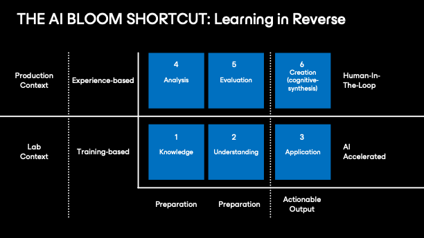

# About this article

This piece didn’t start with a blank page.

It started with a conversation, more than 6,000 lines of dialogue, code and design decisions. The ideas here aren’t new to me. They’ve been forming over years of work in learning design. What AI gave me wasn’t originality. It gave me structure, speed, challenge and a way to test half-formed models in real time.

I’m also offering transparency, an audit, if you like. If you want to know whether using AI like this counts as “cheating,” you can read the full cleaned transcript of the chat that built this article. I’ll only remove personal content and early tangents that didn’t shape the final work. Everything else is on the table.

I’m not using AI as a replacement. I’m using it as a companion.

In this project, I’m the expert in the loop.

---

# Learning in Reverse

This article started from something personal.

I’ve been working in learning design for almost twenty years. I know the theory. I’ve built frameworks, delivered training, taught others how to do the same. But coding? I’d convinced myself that was something other people did. Not because I didn’t care, but because I’d tried, and failed, enough times to believe I just didn’t have the right mind for it.

Then I approached it differently. I stopped trying to learn first. I started by building.

I used AI to help me generate working code, something practical, not theoretical. I didn’t understand most of it at the start, but I could tweak it, break it and fix it again. The core skill wasn’t the abstraction of physical ideas into code anymore, it was pattern recognition and non-linear thinking.

I learned by moving, not reading. In four days, I had a functioning proof-of-concept application and a decent understanding of HTML and JavaScript. That would have taken me weeks, if not months, by traditional methods. And more than likely, like I’d done before, I’d have given up.

All of this was happening concurrently with another project: a pentest emulation game. That’s now grown into a working v1 project called node.zero but also forked into a standalone JavaScript engine with filesystem routing, modular command support, stateful network scanning and a terminal-style interface with plans to not only to finish node.zero but a plan for a second game using the same framework.

Along the way, I’ve learned that this approach, starting with output, shaping it by feel and learning backwards, is often called “vibe-coding.” It’s not a term people use flatteringly. To those with deep expertise, it looks reckless. Unstructured. Naïve. I get the frustration, because I did the work. I didn’t skip the process. I just went at it backwards.

If I can build something, make it work and then learn how I built it, does it matter that I didn’t start with theory? I spent years ‘unable’ to do any of this, I now have working artifacts to show for it. That’s huge.

---

# Rethinking Bloom’s Taxonomy

At the centre of all this is Bloom’s taxonomy, a model I’ve returned to consistently across my time in learning design. And not just Bloom in its original form. I’m fully aware of the refinements made by Krathwohl et al., and the additional dimensional layering developed by the University of St. Louis’ education department. While I don’t agree with all of it, it’s good work. I know the model intimately.

Bloom’s taxonomy categorises different types of cognitive work:

- **Remember** – recalling facts  
- **Understand** – explaining meaning  
- **Apply** – using knowledge in context  
- **Analyse** – examining structure and components  
- **Evaluate** – making decisions, comparisons or judgments  
- **Create** – synthesising novel ideas from complexity

It’s usually presented as a staircase: knowledge leading to comprehension, leading to action and eventually to creation. That framing quietly implies mastery is something you ascend toward, step by step. It’s tidy but it doesn’t reflect how people learn.

AI collapses that model and allows learners to start with “Apply” without climbing the ladder first.

The language doesn’t help. Bloom’s Create isn’t the same as generate. You can ask AI to generate a working app (for the most part…), but that isn’t Bloom-level creation. That level involves judgment, synthesis, evaluation and originality under constraints.

This isn’t a failure of capability. It’s a failure of terminology. And the confusion matters, because it’s right at the heart of how people misuse the shortcut and misunderstand the application of Bloom’s model.

---

# Lab vs. Production: A More Useful Split

To make this more practical, I started splitting Bloom’s six stages into two environments: Lab and Production. These aren’t literal places. They’re risk contexts. They represent the line between learning environments and operational ones.

In the lab, learners can try, fail and iterate freely. Instructors, good ones, have always known this. Over my years of experience teaching people how to train, I’ve emphasised one thing above all else: learners must feel safe. Not as a side benefit. As a prerequisite. Your first job as a trainer is to make it possible for someone to be wrong, publicly, in their assumptions or their execution and not feel punished for it. That safety is where real learning happens.

This is often misunderstood. In-person training that prioritises safety can get unfairly labelled as “soft” or “cuddly,” but the reality is far more pragmatic. We don’t create safety because it feels nice. We create it because it’s the only reliable condition under which learning successfully and efficiently sticks.

That same mindset needs to carry forward into automated and AI-assisted education. We need to embed that same rigour into system design, not just the behaviour of trainers.

The taxonomy divides cleanly across that line:

---

---

### Lab Context (AI-Accelerated)

Levels 1–3: Remember, Understand, Apply  
- Modular, low-risk and repeatable  
- Structured content and defined patterns  
- AI can lead, especially when paired with scaffolding and iterative output

---

### Production Context (Human-in-the-Loop)

Levels 4–6: Analyse, Evaluate, Create  
- Requires ambiguity tolerance, pattern deviation and ethical judgment  
- These are not mechanical stages. They’re experienced ones  
- Human oversight and validation are non-negotiable

---

Typically, organisations aren’t invested in learners reaching Levels 4–6. They want execution, not exploration. Tasks completed. Errors minimised. Compliance boxes ticked. Level 3 output, and they want it stable.

Learners, on the other hand, often want to go further. And here’s the irony: the people capable of operating at those ‘production’ levels are more valuable to the business.

That’s the paradox baked into most corporate curriculum design. Organisations want the outcomes of Level 6 thinking but build learning programs that barely reach Level 2. They try to teach mastery like it’s a checklist; facts, concepts, procedures, maybe a framework or two but you can’t teach someone to be a master solutions architect. Not in a course. Not with content alone. There is no fast-track to full production-level capability. No “I know Kung-Fu” moment. That depth only comes from experience, and it needs a solid and stable learning framework underneath it all.

---

# What the Shortcut Actually Enables

In theory, the shortcut lets you skip to Apply, get something working, then reverse-engineer your way back to understanding. In practice, it’s messier than that.

The first thing you learn isn’t how code works. It’s how AI behaves. And that’s not straightforward. AI will lie. Not maliciously, just confidently and often. It’ll explain things that aren’t true or give answers that sound plausible but don’t work. You can spend hours trying to follow its logic, only to realise there isn’t any.

I’ve spent days pushing into that behaviour. I think I know how it works under the hood, but only because that’s what it told me. The explanation makes sense. The pieces link up. Unless I go read screeds of academic literature on AI, I’ll never really know if any of it is real (incidentally on a cursory glance of literature confirms what it was telling me to be true).

What I do know is this: trial and error eventually carved out a path I could use.

At the start, I tried to get AI to do everything. Why wouldn’t I? That’s the pitch. But the outputs came back vague. Requirements were woolly. Anyone who’s run projects knows this pain, unclear inputs don’t lead anywhere useful, whether it’s humans or machines.

So, I tightened the inputs. Broke apart working examples. Compared patterns. Tweaked, re-tweaked, rebuilt. It helped, for a bit.

Then came brittle logic. Features vanishing mid-session. Bugs creeping in and hiding for hours. Even now, I’m still unpicking some of the fallout.

The longer I worked with AI, the clearer one thing became: it doesn’t push back. Not unless you explicitly ask it to. It finishes what you tell it to finish. Quickly. Politely.

That’s exactly what makes it risky when the understanding underneath isn’t solid yet. It’s worth mentioning here, I’m just using a commercially and publicly available AI. Some of these issues would go away with an learning design purpose-built AI tool (which I did cost up, it’s not as expensive as you’d think, pocket change for a large organisation, about the same as an off-site team meeting!)

Eventually, the pattern showed itself:

- AI can’t do anything useful without clear instruction  
- You can’t give clear instruction without understanding  
- You don’t get understanding until you’ve seen something working and then broken it

That’s the loop. That’s the real shortcut.

And it mirrors something I’ve said to engineers for years:

> *The day everything went right wasn’t the day you learned the most.  
The day it all fell apart, and you had to figure out why, while your job was potentially on the line, was the day you learned the most.*

---

# Experts Still Matter, Just in the Right Place

In the framework I’m building, the lab level refers to modular learning content: repeatable tasks that sit squarely in Levels 1–3 of Bloom’s taxonomy. It’s structured, AI-supported and low-risk by design. But without a clear framework underneath, even that part of the process falls apart.

Production environments demand human review. The ambiguity and contextual nuance at those higher levels can’t be safely delegated, not yet, and maybe not ever.

Experts aren’t being removed. They’re being repositioned. Not as the sole source of truth, but as the final filter at the edge of consequence.

I’m not just saying that, I’m living it. This article is the product of that same pattern. The AI helped accelerate the structure, but I’m the one shaping it, challenging it and deciding what should be kept or cut.

---

# The Strategic Ask

This isn’t a proposal for the future. It’s a pattern already in play, one I’ve seen work and one I’ve lived through directly.

If you’re responsible for learning at scale, the first step isn’t asking how AI fits in. It’s figuring out which parts of your learning strategy are truly “lab,” and which parts are “production.” Separate them clearly and build for them differently. AI can accelerate Level 1–3 competence rapidly and repeatably. Levels 4–6, however, are a different kind of work. They involve ambiguity, judgment and real-world consequence. Individuals who operate well at that level are valuable precisely because that depth doesn’t come from learning content. It comes from experience.

If you’re an individual contributor, team lead, designer or developer, try running your own projects through this lens. Ask yourself where the “lab” ends and where the risk starts to rise. That line isn’t the same for everyone, but it does exist. Most people will only see it once they’ve crossed it.

If you’re still not sure whether this approach holds water, you’re welcome to check. I’ve kept the full chat archive that led to this piece. Aside from a few personal edits, the rest is open to review. That transparency is intentional. This wasn’t magic. It was process. I want you to see it for yourself.

> *The shortcut is real.  
The responsibility is too.*

> *If you're wondering what happens when AI reaches the point where it can reliably perform at Levels 4–6?  
We won’t be training people for those roles. We’ll be automating them.*

---

# Postscript: The Theory I Forgot I Knew and other P.S. thoughts.

This is me writing as myself now, not endlessly optimised and tweaked by AI. Just me. It’s only after writing this that I realised how much theory I’d already been using and didn’t call out (I’ll be up front, because I didn’t put it together till long after!)

Kolb for instance, learning theory 101, his experiential learning cycle maps almost exactly to what I described: start by doing, reflect, extract the pattern, then test it again. I didn’t cite him, and maybe I should have, the model was baked in. That was a classic “oh yeah…” moment.

Same goes for metacognition. For years I’d sort of wrote it off as soft, academic territory. “Thinking about thinking” sounded like something best left to psychology textbooks. But reading this back, it’s everywhere. Picking up on the AI’s limitations. Adjusting my approach midstream. Testing assumptions and catching myself when they broke. It wasn’t deliberate, but it was definitely happening. There is a huge area in metacognition I don’t think is really looked at much but is endlessly fascinating. When you’re working within a system that is broadly ‘intelligent’, the subtle clues in behaviour that tell you it’s not working quite right. It’s a really interesting feeling.

Then there’s cognitive apprenticeship. Except in this case, the “expert” I was learning from wasn’t really an expert. It was a language model. It could produce code and explain itself with confidence, but it wasn’t reliable. The closest metaphor I can think of is that it’s like learning to make Japanese swords from a master craftsman who’s slipping into dementia. The technique is still there. The tradition is still intact. But you can’t just copy it. You have to question everything. That pressure, the fact that I couldn’t trust my teacher, is exactly what made the learning deeper and that mechanism is incredibly interesting to me.

---

# Want to see where I’ve been taking this in my spare time?

[env0-labs Github](https://github.com/)

---

# Here is some reference material if you want to know more about the theoretical side of this subject.

- **Experiential Learning – David Kolb (1984)**  
The classic model of learning by doing. If you want the roots of “build first, understand later,” this is it.

- **Metacognition and Cognitive Monitoring – John Flavell (1979)**  
The original source for the idea of “thinking about thinking.” A bit dense, but historically important.

- **How Learning Works – Ambrose et al. (2010)**  
A great practical book for understanding learning theory without wading through academia. Especially strong on metacognition.

- **Productive Failure – Manu Kapur (2008)**  
Core reading if you're interested in how failing first and then figuring it out actually leads to deeper understanding.

- **Cognitive Apprenticeship – Collins, Brown & Newman (1989)**  
The framework this article stumbles into, learning by watching a master, then doing it yourself. Having a ‘flawed’ master interestingly flips it on it’s head and weaponises that to accelerate learning.

- **Ill-Structured Problem Solving – David Jonassen (1997)**  
Explores how learning happens when problems are messy, undefined and real, like most things worth learning.

- **Should Robots Replace Teachers? – Neil Selwyn (2021)**  
Explores the real tensions between AI and education. Useful context if you're thinking about where human expertise still matters but being a few years old is now pretty much out of date!
